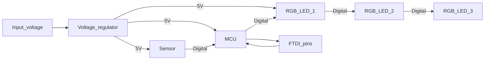
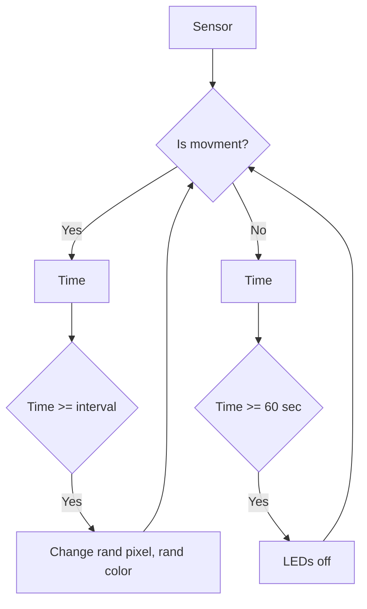

# Electronic sculpture "Kolm silma"

It changes LEDs' colours when it detects movements.

## Hardware

* MCU: Selfmade Arduino Uno
* RGB LED: W2812 NeoPixels  x 3pc.
* Sensor: RCWL-0516 Microwave Proximity

### Diagram

## RCWL-0516

* RSWL-0516 is a microwave proximity sensor.
* Operates on 4-28V.
* Built in 3.3V voltage regulator.
* Works at 3.18GHz.
* Uses droppler radar to detect motion.

### Pins

pin | comment
----|--------
3V3 |3.3V Output
GND | Ground
OUT | Digital output
VIN | 4-28V Power input
CDS | Optional light sensor

### Doppler Effect

* Discovered in 1842 by Christian Doppler.
* Change in frequency observed when source is moving.
* Applies to all waves: light, sound, radio and water waves.
* Astronomy - red or blue shifting of light from distant object.
* Satellite communications -used dynamic doppler compensation.
* Medical -echocardiogram measures blood flow.

## Software

### Block diagram

## Links

* [Include diagrams in your Markdown files with Mermaid](https://github.blog/2022-02-14-include-diagrams-markdown-files-mermaid/)
* [Helper function for unpacking rgb](https://github.com/adafruit/Adafruit_NeoPixel/issues/88)

 ___

Copyright 2022, Tauno Erik, [taunoerik.art](https://taunoerik.art).
